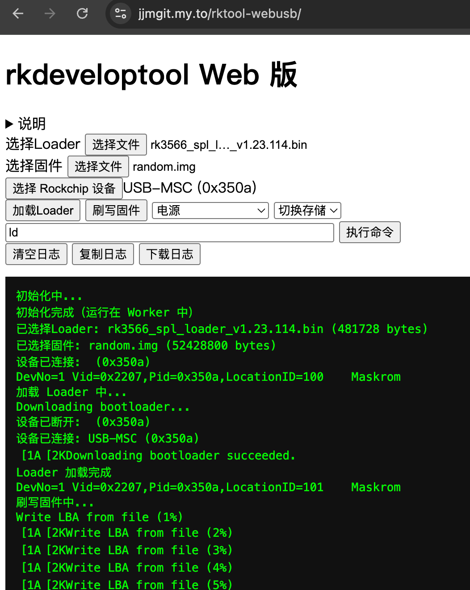

# rkdeveloptool port to wasm/webusb

将 `rkdeveloptool` 编译为 WebAssembly，并通过适配层在浏览器（WebUSB）与 Node.js 中复用同一套 CLI 调用方式。

已支持固件格式：
1. raw 磁盘镜像 （.img）
2. 压缩 raw 磁盘镜像，包括 iStoreOS，OpenWRT，Armbian 等（.img.gz, .img.xz）
3. RKFW 固件，一般安卓固件是这种格式 （.img）

> 除了 raw 磁盘镜像，其他都是在前端靠 VFS 实现，非 rkdeveloptool 原有功能。

## 环境要求

- Emscripten 3.1.48+ (推荐4.x)
- CMake 3.16+
- Node.js 18+
- `curl` 或 `wget`
- `patch`

## 准备
```bash
bash ./prepare_sources.sh
```

这个脚本会自动：

1. 初始化 `rkdeveloptool` submodule
2. 下载并解压官方 `libusb-1.0.29` 源码包到 `ref/`
3. 自动应用 `patches/libusb` 和 `patches/rkdeveloptool` 下的补丁

补丁按“未打则应用、已打则跳过”的方式处理，重复执行是安全的。


## 构建 WASM

```bash
bash ./build_wasm.sh
```

`build_wasm.sh` 会先自动调用 `./prepare_sources.sh`，所以正常情况下直接执行这一条也可以。

如需一条命令完成“准备源码 + 编译 WASM + 打包网页归档”，直接执行：

```bash
bash ./mkweb.sh
```

输出文件为 `webarchive/webarchive.tar.gz`。

如需清理网页归档和 WASM 构建产物，可执行：

```bash
bash ./mkweb.sh clean
```

或使用 npm 脚本：

```bash
npm run build:wasm:dev
npm run build:wasm:debug
npm run build:wasm:relwithdebinfo
npm run build:wasm:release
```

构建完成后会在 `dist/` 生成：

- `rkdeveloptool.js`
- `rkdeveloptool.wasm`

默认构建会关闭 JS 混淆（`RK_WASM_JS_MINIFY=0`，内部使用 `--minify 0`），便于排查问题。

如需可调试构建（保留符号并生成 source map），可使用：

```bash
npm run build:wasm:debug
```

等效环境变量：`RK_WASM_BUILD_TYPE=Debug RK_WASM_DEBUG_INFO=1 RK_WASM_JS_MINIFY=0`。

如需发布体积优化版本，可开启 JS 混淆：

```bash
RK_WASM_JS_MINIFY=1 ./build_wasm.sh
```

## Node.js 使用

```bash
npm install
node examples/nodejs/cli.js ld
```

如需在 Node.js 中通过 wrapper 传文件参数，推荐先用本地路径构造 `NodeBlob`（`import { NodeBlob } from './src/node/node-blob.js'`），再传给 `mountFile()` 或 `runCommand(..., { fileSource })`。

## 浏览器使用

浏览器环境需要 HTTPS 或 localhost。可在仓库根目录启动一个静态服务：

```bash
python3 -m http.server 8080
```

然后访问：

- `http://localhost:8080/examples/browser/index.html`

页面内可：

- 通过 file input 选择固件文件
- 选择 Rockchip 设备（`navigator.usb.requestDevice`）
- 执行 `ld`、`db`、`wl` 等命令



## 测试

```bash
npm run test:unit
npm run test:build
```

## 文档

- 迁移说明：`docs/porting-notes.md`
- API 文档：`docs/api.md`

## References

- https://developer.mozilla.org/en-US/docs/Web/API/WebUSB_API
- https://wicg.github.io/webusb/
- https://github.com/node-usb/node-usb
- https://web.dev/articles/porting-libusb-to-webusb
- https://github.com/GoogleChromeLabs/web-gphoto2/blob/main/Makefile
- https://developer.mozilla.org/en-US/docs/WebAssembly
- https://opensource.rock-chips.com/wiki_Rkdeveloptool
- https://github.com/aezizhu/rkfw-unpack
